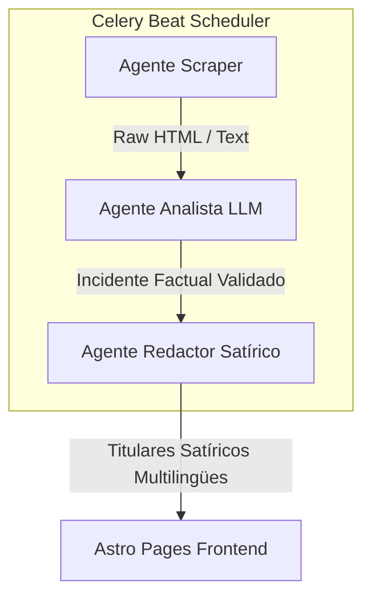
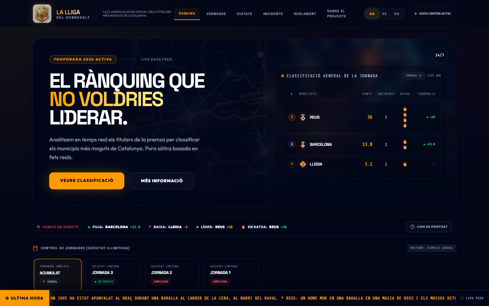
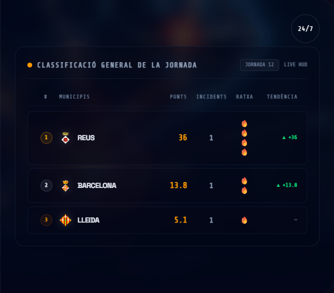
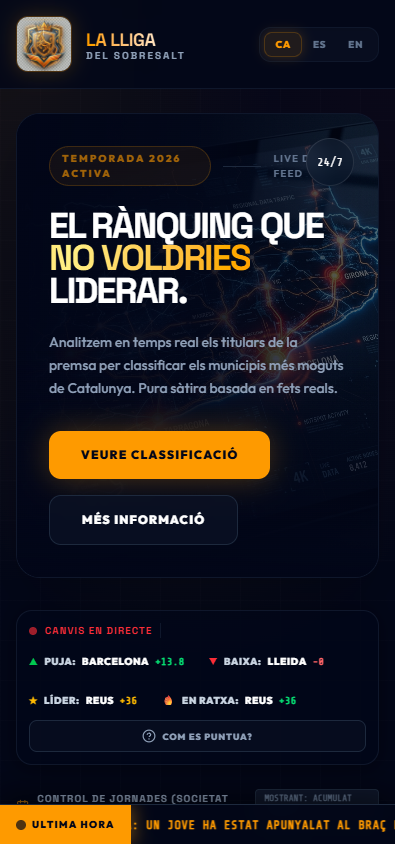
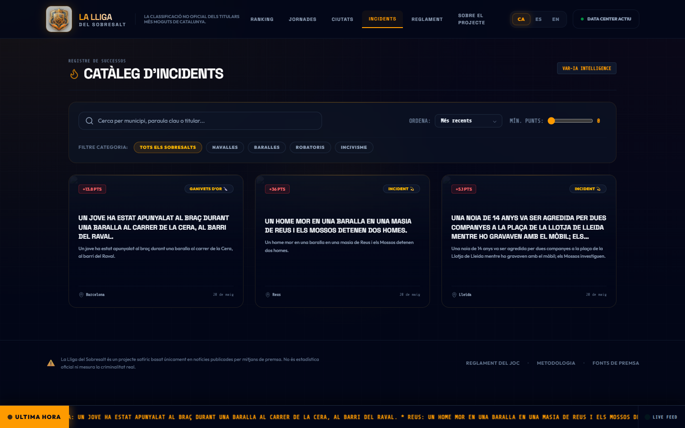
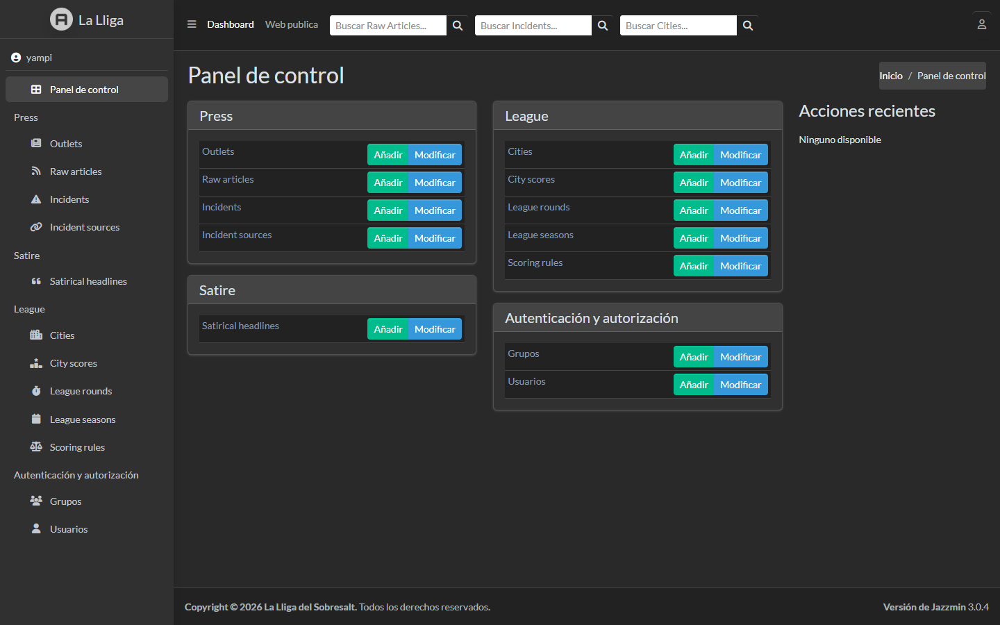

# La Lliga del Sobresalt

<div align="center">

[](LICENSE)
[](https://astro.build/)
[](https://www.djangoproject.com/)
[](https://tailwindcss.com/)
[](https://preactjs.com/)

<p align="center">
  <strong>El portal e-sports satírico definitivo de Cataluña.</strong><br />
  Análisis semántico-factual de incidentes reales traducidos en tiempo real a una liga competitiva y dramática de videojuegos.
</p>

</div>

---

## Tabla de Contenidos
- [El Concepto](#el-concepto)
- [Arquitectura del Sistema de Agentes (IA)](#arquitectura-del-sistema-de-agentes-ia)
- [Showcase Visual & Capturas de Producción](#showcase-visual--capturas-de-producción)
- [Stack Tecnológico](#stack-tecnológico)
- [Estructura del Monorepo](#estructura-del-monorepo)
- [Guía de Inicio Rápido](#guía-de-inicio-rápido)
  - [Método A: Desarrollo Rápido con Docker](#método-a-desarrollo-rápido-con-docker)
  - [Método B: Entorno Local Nativo](#método-b-entorno-local-nativo)
- [Ejecución y Depuración Manual de Agentes](#ejecución-y-depuración-manual-de-agentes)
- [Integración CodeGraph](#integración-codegraph)
- [Políticas de Seguridad y Producción](#políticas-de-seguridad-y-producción)
- [Licencia](#licencia)

---

## El Concepto

**La Lliga del Sobresalt** es un portal web y backend satírico que gamifica la actualidad factual de Cataluña. Inspirándose en el estilo narrativo maximalista de las ligas de videojuegos competitivos (e-sports / cyberpunk), el sistema procesa sucesos cotidianos de municipios catalanes publicados en prensa y los puntúa para generar una clasificación general y desgloses por temporada.

El ecosistema funciona de forma **completamente neutral, aséptica y automatizada**, garantizando la veracidad de los hechos crudos antes de aplicar la capa creativa y humorística.

> [!IMPORTANT]
> **Claridad Editorial y Ética**: Este portal **no mide criminalidad real ni utiliza datos oficiales de seguridad**. Es un ejercicio puramente de humor y analítica satírica basado exclusivamente en lo publicado en medios de prensa tradicionales que forman parte de una lista blanca (whitelist).

---

## Arquitectura del Sistema de Agentes (IA)

El motor del backend se basa en tres agentes autónomos secuenciales orquestados con **Celery** y persistidos en la base de datos de **Django**:



### 1. Agente Scraper (Extractor de Prensa)
- **Ubicación**: [scraper.py](apps/backend/press/services/scraper.py)
- Extrae de forma periódica las noticias de canales RSS y portales web incluidos en la lista blanca.
- Emite una cabecera transparente identificativa: `User-Agent: LaLligaDelSobresaltBot/0.1`.
- Respeta estrictamente los límites de peticiones (rate-limiting) y no intenta saltar paywalls.

### 2. Agente Analista (Incidente Factual)
- **Ubicación**: [extractor.py](apps/backend/press/services/extractor.py)
- Analiza semánticamente las noticias utilizando LLMs para validar e identificar incidentes puntuables reales de forma aséptica.
- Genera resúmenes factuales en tres idiomas (**Catalán, Español e Inglés**) acotados estrictamente a **160 caracteres**.
- **Hibridación e Inteligencia Fallback**:
  - **Prioridad 1 (Nube)**: OpenRouter (modelos de bajo coste/gratuitos, e.g., `meta-llama/llama-3-8b-instruct:free`).
  - **Prioridad 2 (Respaldo)**: OpenCode (servicio en la nube alternativo).
  - **Prioridad 3 (Local)**: Instancia de Ollama (`qwen3:4b` en el puerto `11434`).

### 3. Agente Redactor (Sátira Deportiva)
- **Ubicación**: [headlines.py](apps/backend/satire/services/headlines.py)
- Traduce el incidente factual aséptico en titulares dramáticos de estilo e-sports.
- Genera de forma síncrona chistes adaptados culturalmente y coherentes en los tres idiomas del portal.

---

## Showcase Visual & Capturas de Producción

Las siguientes capturas han sido tomadas en tiempo real directamente de la aplicación desplegada en producción:

### Dashboard Principal (Escritorio)
Una interfaz HUD de videojuego oscura e inmersiva con degradados vibrantes, micro-animaciones premium y marcadores agregados.


### Catalonia Interactive Heatmap
Mapeado interactivo de nodos en SVG que muestra de manera dinámica la intensidad y el reparto de puntos a lo largo del territorio catalán.


### Optimización Mobile First
Experiencia totalmente fluida y adaptada a dispositivos móviles con menús compactos y cajones interactivos de información detallada (drawers).


### Catálogo Factual de Incidentes
Un compendio ordenado con filtros interactivos de búsqueda, categorías y puntuación donde se pueden consultar los sucesos y su contraste satírico.


### Panel de Administración (Gestión de Módulos)
Interfaz administrativa segura basada en Django Admin para la supervisión, administración y validación directa de los incidentes redactados, municipios y fuentes de prensa.


---

## Stack Tecnológico

El monorepo hace uso de un conjunto de tecnologías modernas de alto rendimiento:

*   **Frontend (Static Web Hub)**:
    *   **Astro Engine**: Carga ultrarrápida e hidratación bajo demanda.
    *   **Preact**: UI reactiva ligera para los componentes interactivos.
    *   **Nanostores**: Gestión de estado reactivo ultra-eficiente y multi-idioma.
    *   **TailwindCSS**: Estilizado inmersivo estilo HUD Cyberpunk.
*   **Backend (Core de Agentes & API)**:
    *   **Django**: Gestión administrativa, API REST pública y base de datos persistente.
    *   **PostgreSQL**: Almacenamiento seguro y escalable de noticias e incidentes.
*   **Orquestación y Procesamiento de Tareas**:
    *   **Celery & Redis**: Cola de tareas asíncronas y scheduler periódico.
    *   **Puppeteer**: Herramientas de automatización y captura de pantallas en producción.
*   **Inteligencia Artificial**:
    *   **OpenRouter / OpenCode / Ollama**: Modelos locales y remotos para la extracción analítica libre de sesgo.

---

## Estructura del Monorepo

El proyecto está estructurado de forma modular utilizando `pnpm workspaces`:

```bash
lliga_sobresalt/
├── apps/
│   ├── web/               # Aplicación web estática generada con Astro + Preact
│   └── backend/           # Servidor monolítico Django (API, Admin, Agentes Celery)
├── docs/
│   ├── assets/            # Capturas de pantalla oficiales y assets visuales
│   └── technical_guide.md # Guía detallada de despliegue y desarrollo
├── scripts/
│   ├── capture_screenshots.js # Script automatizado en Puppeteer para capturar la web
│   └── capture_admin.js       # Script automatizado en Puppeteer para capturar el panel de administración
├── agents.md              # Especificación detallada del flujo y reglas de agentes IA
├── package.json           # Configuración del monorepo
├── pnpm-workspace.yaml    # Configuración de workspaces de pnpm
└── README.md              # Documento principal del repositorio
```

---

## Guía de Inicio Rápido

### Requisitos Previos
- **Node.js** (v18 o superior) e instalador **pnpm** (`npm i -g pnpm`).
- **Docker & Docker Compose** (para ejecutar con contenedores).
- **Python 3.14** (si prefieres ejecutar el entorno local de backend nativo).

---

### Método A: Desarrollo Rápido con Docker

Este método arranca PostgreSQL, Redis, Celery y el backend Django de forma automática en un cluster aislado:

```powershell
# 1. Copiar configuración base de Docker
Copy-Item .env.docker.example .env

# 2. Levantar los contenedores en segundo plano
docker compose --env-file .env up -d --build

# 3. Instalar dependencias del frontend y arrancar Astro
pnpm install
pnpm dev
```
El frontend Astro se ejecutará localmente en `http://localhost:4321` y el backend en `http://localhost:8000`.

---

### Método B: Entorno Local Nativo

Para trabajar de manera directa en tu entorno de archivos local:

#### 1. Backend Django (.venv)
```powershell
# Crear y activar entorno virtual de Python
py -3.14 -m venv .venv
.venv\Scripts\activate

# Instalar requisitos
python -m pip install --upgrade pip
pip install -r apps/backend/requirements.txt

# Configurar variables de entorno locales
Copy-Item .env.example .env

# Aplicar migraciones y lanzar servidor de desarrollo
cd apps/backend
python manage.py migrate
python manage.py createsuperuser
python manage.py runserver
```

#### 2. Frontend Astro
```powershell
# Desde la raíz del monorepo
pnpm install
pnpm dev
```

---

## Ejecución y Depuración Manual de Agentes

Puedes forzar la ejecución inmediata de los agentes y tareas de Celery a través de los siguientes comandos de depuración:

### Vía Docker Compose
```powershell
# Ejecutar raspador de noticias de prensa
docker compose --env-file .env exec backend python manage.py scrape_press

# Iniciar análisis y procesado LLM de artículos pendientes
docker compose --env-file .env exec backend python manage.py process_articles

# Forzar recálculo del ranking general y desgloses de la temporada
docker compose --env-file .env exec backend python manage.py recalculate_rankings
```

### Vía Entorno Local Nivel de Host
```powershell
.venv\Scripts\python apps/backend/manage.py scrape_press
.venv\Scripts\python apps/backend/manage.py process_articles
.venv\Scripts\python apps/backend/manage.py recalculate_rankings
```

---

## Integración CodeGraph

El repositorio está indexado semánticamente mediante **CodeGraph** para potenciar el análisis de dependencias e inteligencia contextual de IA:

```powershell
# Comprobar estado de indexación de grafos local
pnpm codegraph:status

# Sincronizar el grafo de dependencias
pnpm codegraph:sync

# Lanzar consultas semánticas rápidas sobre entidades del código
pnpm exec codegraph query Incident --limit 5
```

---

## Políticas de Seguridad y Producción

- **Sin Bypass de Paywalls**: Los raspadores solo acceden a feeds públicos y a la porción libre de artículos.
- **Entorno Seguro**: Asegúrate de establecer `DEBUG=False` en entornos de producción.
- **Configuración de Cabeceras**: Configura adecuadamente `ALLOWED_HOSTS`, `CORS_ALLOWED_ORIGINS` y `CSRF_TRUSTED_ORIGINS` para aislar el backend en el subdominio VPS y autorizar únicamente al subdominio HTTPS de GitHub Pages donde reside el frontend estático.
- **Logs y Depuración**: Cualquier volcado de datos experimentales o script temporal debe alojarse estrictamente en el directorio `/debug/` en la raíz del proyecto para evitar filtraciones fortuitas.

---

## Licencia

Este proyecto está bajo la Licencia **MIT**. Consulta el archivo `LICENSE` para más detalles.
