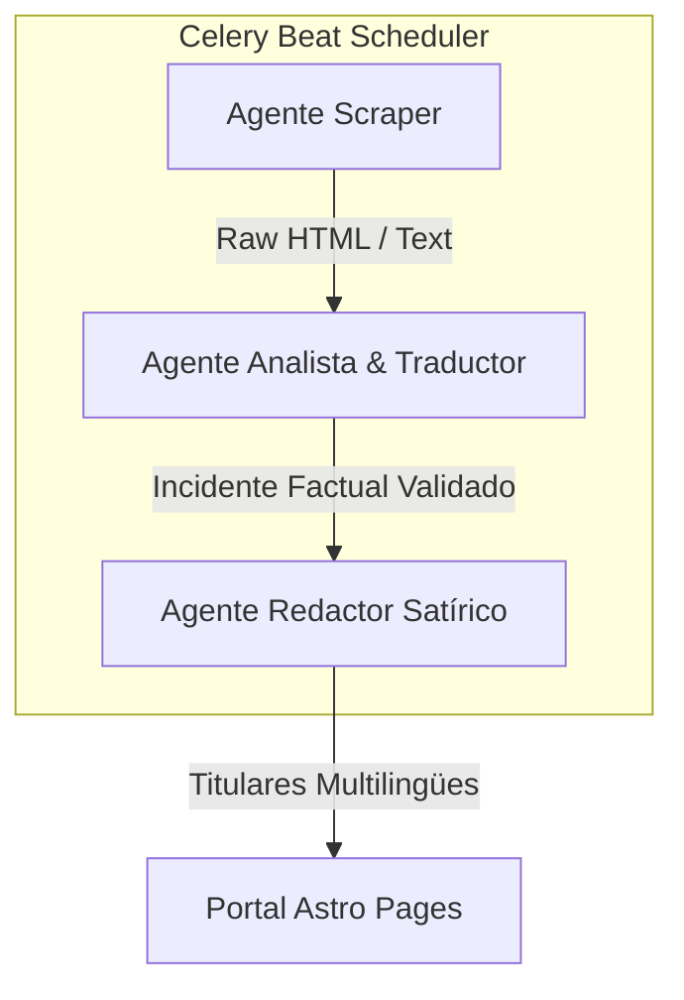

# 🤖 Sistema de Agentes Autónomos: La Lliga del Sobresalt

Este documento define la arquitectura técnica, flujos de datos y reglas de operación para los **Agentes de IA y Automatización** del backend y portal de **La Lliga del Sobresalt**.

El sistema integra de forma secuencial la recolección tradicional de noticias, análisis semántico-factual libre de sesgos con LLMs y redacción creativa satírica automatizada.

---

## 🧭 Arquitectura de Agentes y Flujo de Datos

El ciclo de vida del dato se compone de tres agentes en cola que se orquestan mediante **Celery** y persisten en la base de datos de **Django**:



---

### 1. 🕷️ Agente Scraper (Extractor de Prensa)
- **Fichero Principal**: [scraper.py](file:///c:/Users/elyam/Documents/lliga_sobresalt/apps/backend/press/services/scraper.py)
- **Activación**: Programado periódicamente (`scrape_press_task`).
- **Comportamiento**:
  - Lee canales RSS y portales web de medios en la lista blanca (*whitelist*).
  - Emite cabecera transparente: `User-Agent: LaLligaDelSobresaltBot/0.1`.
  - Respeta límites de peticiones (*rate-limiting*) y no intenta saltar paywalls.
  - Guarda en base de datos el contenido textual crudo (`raw_text`) y la imagen principal de la noticia.

### 2. 🧠 Agente Analista (Extractor de Incidentes Factuales)
- **Fichero Principal**: [extractor.py](file:///c:/Users/elyam/Documents/lliga_sobresalt/apps/backend/press/services/extractor.py)
- **Activación**: Programado o por evento (`process_articles_task`).
- **Objetivo**: Extraer incidentes puntuables reales de forma factual y aséptica.
- **Esquema Pydantic (`ExtractedIncident`)**:
  ```python
  class ExtractedIncident(BaseModel):
      canonical_title: str          # Titular resumido aséptico del suceso
      category: str                 # apunyalament | pelea | robo_violento | incivismo
      points: int                   # Calculado dinámicamente según la categoría
      happened_at: datetime         # Fecha y hora del suceso real
      municipality_slug: str        # Mapea al slug del municipio de la BD
      short_neutral_summary_ca: str # Resumen factual neutral en Catalán (máx. 160 caracteres)
      short_neutral_summary_es: str # Resumen factual neutral en Español (máx. 160 caracteres)
      short_neutral_summary_en: str # Resumen factual neutral en Inglés (máx. 160 caracteres)
  ```
- **Hibridación e Inteligencia Fallback**:
  - **Prioridad 1 (Nube)**: OpenRouter (modelos gratuitos/bajo coste, e.g., `meta-llama/llama-3-8b-instruct:free`).
  - **Prioridad 2 (Respaldo)**: OpenCode (servicio en la nube alternativo).
  - **Prioridad 3 (Local)**: Instancia Ollama (`qwen3:4b` en puerto `11434`).

### 3. ✍️ Agente Redactor (Sátira Deportiva)
- **Fichero Principal**: [headlines.py](file:///c:/Users/elyam/Documents/lliga_sobresalt/apps/backend/satire/services/headlines.py)
- **Activación**: Ejecución manual o en cola tras la aprobación de un administrador.
- **Objetivo**: Traducir el hecho factual árido en titulares dramáticos de estilo "e-sports" o satíricos.
- **Salida**: Genera simultáneamente el titular satírico y contextualizado culturalmente en **Catalán**, **Español** e **Inglés**, manteniendo coherencia de humor y chistes en cada idioma.

---

## ⏱️ Orquestación de Tareas de Celery

Los agentes corren de forma asíncrona distribuidos en tareas periódicas gestionadas por **Redis**:
- `scrape_press_task`: Llama al Agente Scraper para recolectar nuevas noticias.
- `process_articles_task`: Llama al Agente Analista para procesar con LLMs artículos nuevos.
- `recalculate_rankings_task`: Actualiza las posiciones, puntos acumulados e históricos de la temporada basándose en los incidentes validados.

---

## 🛠️ Ejecución y Depuración Manual

### Entorno Docker (Consola del Contenedor Backend)
```powershell
# Iniciar raspador
docker compose --env-file .env exec backend python manage.py scrape_press

# Iniciar procesamiento LLM de artículos pendientes
docker compose --env-file .env exec backend python manage.py process_articles

# Forzar recalcular la clasificación general de la temporada
docker compose --env-file .env exec backend python manage.py recalculate_rankings
```

### Entorno Local (Directamente mediante .venv de Windows)
```powershell
.venv\Scripts\python apps/backend/manage.py scrape_press
.venv\Scripts\python apps/backend/manage.py process_articles
.venv\Scripts\python apps/backend/manage.py recalculate_rankings
```

---

## 🤝 Directrices para Copilotos y Agentes de IA (Antigravity)

Si eres un agente de desarrollo de IA (como **Antigravity**) trabajando en este repositorio, debes cumplir estrictamente con las siguientes directrices de ingeniería:

### 1. Gestión de Archivos y Depuración
- **Carpeta de Depuración**: Cualquier archivo temporal, logs pesados, volcados de datos experimentales o scripts de prueba debe ubicarse estrictamente dentro de la carpeta `/debug/` en la raíz del proyecto. Este directorio está explícitamente ignorado en `.gitignore`.
- **Integridad de Comentarios**: Mantén todos los comentarios de cabecera, cadenas de documentación (docstrings) y comentarios de lógica interna intactos, a menos que se te pida explícitamente cambiarlos.

### 2. Estilización del Frontend (Astro + Preact)
- **Clases Semánticas**: Usa y respeta los selectores semánticos predefinidos bajo el prefijo `class="sobresalt-*"` en el DOM para realizar modificaciones o identificar componentes.
- **Generación de Recursos Visuales**: Para mockups o fondos complejos, haz uso del generador de imágenes `generate_image` en lugar de agregar marcadores vacíos o placeholders feos.

### 3. Flujo de Trabajo Técnico Riguroso
- **Validaciones Estáticas**: Tras cambiar esquemas o lógica del frontend, ejecuta siempre `pnpm build` para asegurar la compilación correcta de TypeScript y del Astro Engine.
- **Validación del Backend**: Valida la integridad de la base de datos de Django corriendo:
  ```powershell
  pnpm backend:check
  pnpm backend:test
  ```
