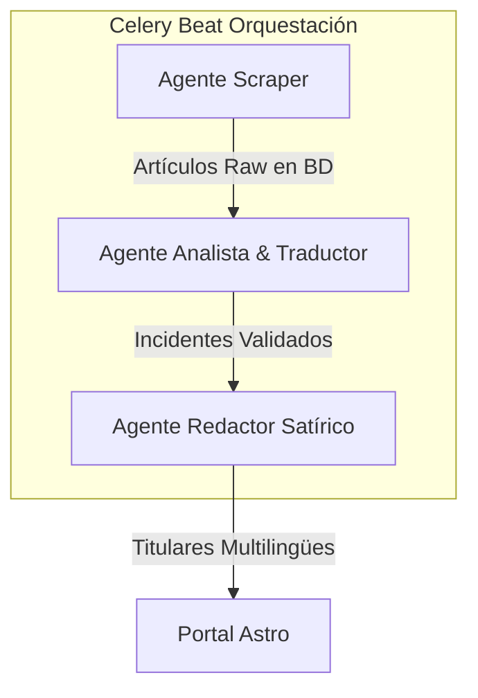

# 🤖 Sistema de Agentes: La Lliga del Sobresalt

Este documento describe la arquitectura, flujo y procedimientos de operación para los **Agentes de IA y Automatización** que impulsan el backend y el portal de **La Lliga del Sobresalt**.

El sistema combina raspado de noticias tradicional, análisis factual estructurado con modelos de lenguaje masivo (LLMs) y redacción creativa satírica automatizada.

---

## 🧭 Arquitectura de Agentes

El ciclo de vida de los datos del portal está orquestado por tres agentes autónomos y especializados que actúan en secuencia:



---

### 1. 🕷️ Agente Scraper (Extractor de Prensa)
* **Fichero Principal**: [scraper.py](file:///c:/Users/elyam/Documents/lliga_sobresalt/apps/backend/press/services/scraper.py)
* **Objetivo**: Raspar periódicamente fuentes RSS y páginas web de los medios deportivos y de prensa generalista incluidos en la lista blanca (*whitelist*).
* **Características**:
  * Identificación transparente mediante un `User-Agent` personalizado (`LaLligaDelSobresaltBot/0.1`).
  * Respeto absoluto a los límites de frecuencia de peticiones (*rate-limiting*) y políticas de paywalls (no intenta saltar muros de pago).
  * Extracción del contenido textual crudo (`raw_text`) y de la imagen principal de la noticia para su posterior análisis.

### 2. 🧠 Agente Analista (Extractor de Incidentes Factuales)
* **Fichero Principal**: [extractor.py](file:///c:/Users/elyam/Documents/lliga_sobresalt/apps/backend/press/services/extractor.py)
* **Objetivo**: Leer el texto de las noticias y determinar si ha ocurrido un suceso puntuable de forma factual, libre de sesgos y estructurado.
* **Características**:
  * Mapeo robusto a esquemas de datos **Pydantic** (`ExtractedIncident`).
  * **Análisis Multilingüe Simultáneo**: El extractor genera el resumen neutral factual en tres idiomas al mismo tiempo: Catalán (`short_neutral_summary_ca`), Español (`short_neutral_summary_es`) e Inglés (`short_neutral_summary_en`).
  * Soporte híbrido: Utiliza **OpenRouter** (modelos en la nube como `meta-llama/llama-3-8b-instruct:free`) y fallback local con **Ollama** (`qwen3:4b` o equivalente).

### 3. ✍️ Agente Redactor (Sátira Deportiva)
* **Fichero Principal**: [headlines.py](file:///c:/Users/elyam/Documents/lliga_sobresalt/apps/backend/satire/services/headlines.py)
* **Objetivo**: Convertir el hecho factual árido en un titular de estilo satírico/e-sports con tono humorístico, maximalista y dramático.
* **Características**:
  * Formulación de chistes deportivos y sintonización de la jerga de la liga de sobresaltos.
  * Traducción y generación paralela del titular humorístico en **Catalán**, **Español** e **Inglés** respetando la coherencia del chiste cultural de cada idioma.

---

## ⏱️ Orquestación y Tareas de Celery

Los agentes se ejecutan de manera asíncrona y automatizada utilizando **Celery** y **Redis** como bróker de mensajería:

* **`scrape_press_task`**: Despierta al *Agente Scraper* para recolectar nuevas noticias.
* **`process_articles_task`**: Invoca al *Agente Analista* para procesar artículos no analizados mediante LLMs.
* **`recalculate_rankings_task`**: Actualiza el marcador general e histórico de la temporada basándose en los incidentes aprobados por los administradores.

---

## 🛠️ Ejecución y Depuración de Agentes en Local

Si estás realizando tareas de desarrollo, puedes lanzar los agentes de forma manual o utilizar herramientas de depuración local.

> [!WARNING]
> Para no "ensuciar" el monorepo y evitar subidas accidentales a Git, todos los scripts experimentales y archivos de logs/debug deben almacenarse exclusivamente dentro de la carpeta `/debug/` de la raíz, la cual se encuentra ignorada por el archivo `.gitignore`.

### Comandos de Ejecución Manual (Entorno Docker)

Lanza la recolección y el procesamiento desde la consola del contenedor del backend:

```powershell
# 1. Ejecutar el raspador de noticias
docker compose --env-file .env exec backend python manage.py scrape_press

# 2. Procesar artículos pendientes con los LLM (OpenRouter / Ollama)
docker compose --env-file .env exec backend python manage.py process_articles

# 3. Recalcular las posiciones de la temporada
docker compose --env-file .env exec backend python manage.py recalculate_rankings
```

### Ejecución Manual sin Docker (Modo .venv)

Si prefieres correr el backend directamente sobre tu sistema de archivos de Windows utilizando el entorno virtual:

```powershell
# Activar entorno y ejecutar comandos
.venv\Scripts\python apps/backend/manage.py scrape_press
.venv\Scripts\python apps/backend/manage.py process_articles
```

---

## 🤝 Copiloto de IA de Desarrollo (Antigravity)

Este proyecto está construido en colaboración con **Antigravity**, un agente de IA par programador. Para interactuar de forma óptima durante el desarrollo:

1. **Ajustes de UI/UX**: Utiliza las clases semánticas `class="sobresalt-*"` del DOM de Astro y Preact para indicarle al copiloto exactamente qué elemento o contenedor visual deseas estilizar o modificar.
2. **Generación de Imágenes**: El copiloto utiliza la herramienta `generate_image` para crear mockups o fondos de diseño premium (como los del Hero), evitando marcadores de posición (*placeholders*) vacíos.
3. **Flujo de Trabajo Estricto**: Todo cambio complejo o de internacionalización de datos debe diseñarse bajo la supervisión de un plan estructurado (`implementation_plan.md`) y verificarse mediante compilaciones estáticas estrictas de Astro (`pnpm build`).
